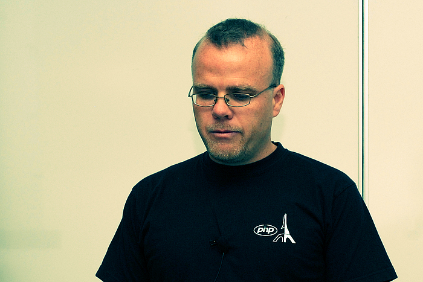
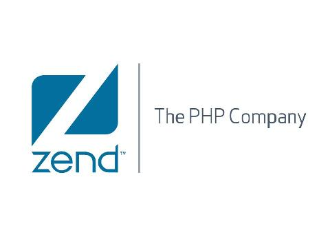

#The Modern Era of PHP

---

##Phil Betley
###@jpbetley
###github.com/jpbetley
###phil@phproc.com

---

#My Story

---

#How Did We Get Here? 

---

^http://buytaert.net/sites/buytaert.net/files/cache/drupalcon-sunnyvale-2007-rasmus-lerdorf-700x700.jpg

^Rasmus Lerdorf started PHP in 1994 as a set of CGI binaries written in C. The syntax we know today wasn't introduced until 1998.

---

^http://mayeul.com/uploads/2010/09/zend-php-company.jpg

^PHP 4 introduced the Zend Engine, which is the engine that is still used today by most PHP applications. It introduced a lot of new features, but it was still a largely procedural language.

---

#PHP 5

^PHP 5 introduced a lot of great features that built into what I call modern PHP.

---

###PHP 5 Features
- Standard PHP Library
- Type hinting
- Exception Classes
- PDO

---

###PHP 5 Object Model
- Classes (abstract) and interfaces
- Static Methods
- Magic Methods
- Autoload Method
- Zend Engine 2

^ This was the beginning of object oriented programming in PHP. With the introduction of a fully functional object model, we could build much richer and encapsulated applications. This also gave rise to the usage of Design Patterns within PHP.

---

###PHP 5.1
- Date library overhaul
- Performance improvements (carries with each version)
- PDO enabled by default

---

###PHP 5.2
- Better memory management
- JSON support
- Zip extension
- Input filtering
- File upload progress tracking

---

###PHP 5.3
- Namespaces
- Late static binding
- Lambda and closure support
- Optional garbage collection
- Syntax additions

^Syntax - ternary operator, __callStatic(), etc

^This is the true start of Modern PHP. With the introduction of the myriad of features introduced in this version, devs were allowed to do much more than before.

---

###PHP 5.4
- Traits
- New array syntax
- Built-in web server
- Closures support `$this`

--- 

###PHP 5.5
- Zend OPCache
- Password hashing API
- Generators
- `finally` keyword

---

#Object Oriented Programming

^With the new features that have been continuously added throughout the lifetime of PHP 5, PHP devs have been making a transition to using more OOP practices and design patterns

---

###Design Patterns
- Factory
- Iterator
- Decorator
- Front Controller
- Model-View-Controller

---

