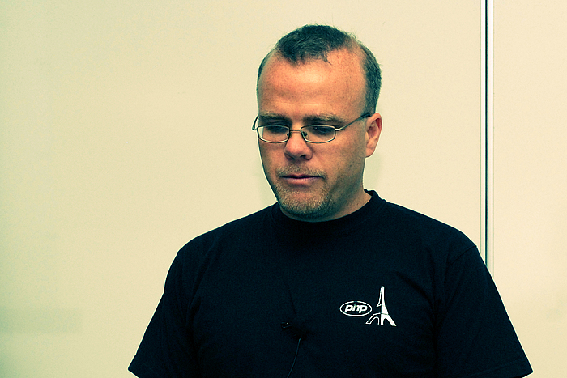

#The Modern Era of PHP

---

##Phil Betley
###@jpbetley
###github.com/jpbetley
###phil@phproc.com

---

#My Story

---

#How Did We Get Here? 

---

##Rasmus Lerdorf

^Rasmus Lerdorf started PHP in 1994 as a set of CGI binaries written in C. The syntax we know today wasn't introduced until 1998.

---

^PHP 4 introduced the Zend Engine, which is the engine that is still used today by most PHP applications. It introduced a lot of new features, but it was still a largely procedural language.

---

#PHP 5

^PHP 5 introduced a lot of great features that built into what I call modern PHP.

---

#PHP 5 Features
- Standard PHP Library
- Type hinting
- Exception Classes
- PDO

---

#PHP 5 Object Model
- Classes (abstract) and interfaces
- Static Methods
- Magic Methods
- Autoload Method
- Zend Engine 2

^ This was the beginning of object oriented programming in PHP. With the introduction of a fully functional object model, we could build much richer and encapsulated applications. This also gave rise to the usage of Design Patterns within PHP.

---

#PHP 5.1
- Date library overhaul
- Performance improvements (carries with each version)
- PDO enabled by default

---

#PHP 5.2
- Better memory management
- JSON support
- Zip extension
- Input filtering
- File upload progress tracking

---

#PHP 5.3
- Namespaces
- Late static binding
- Lambda and closure support
- True OOP
- Syntax additions

^Syntax - ternary operator, __callStatic(), etc. This is the true start of Modern PHP. With the introduction of the myriad of features introduced in this version, devs were allowed to do much more than before.

---

#PHP 5.4
- Traits
- New array syntax
- Built-in web server
- Closures support `$this`

--- 

#PHP 5.5
- Zend OPCache
- Password hashing API
- Generators
- `finally` keyword

---

#Object Oriented Programming

^With the new features that have been continuously added throughout the lifetime of PHP 5, PHP devs have been making a transition to using more OOP practices and design patterns

---

#Design Patterns
- Factory
- Iterator
- Decorator
- Front Controller
- Model-View-Controller

---

# Autoloading

^Also included with new versions of PHP is the capability to do class autoloading. Before this, we'd have to require/include every php file we needed in order to use it.

---

## `__autoload()`
## Changed Everything

---

##Page Controller Pattern

^The page controller pattern is probably the way most of us did things back when we started toying around with php. When we needed a new page, we created a new .php file, and someone would navigate to that page in a browser.

---

## Front Controller Pattern

^We replaced that with the front controller pattern. This pattern basically gave us the ability to send all requests to a single file - the front controller. And it would handle the requests off to the places we wanted it to go. Now we could keep all of our code hidden from the web server, and only keep the front controller in our public web root.

---

## Because of this better structure, we came upon...

---

# The Rise of the Frameworks

---

# Frameworks
- Zend
- Codeigniter
- CakePHP
- FuelPHP
- Symfony

---

#Frameworks
- Laravel
- Aura
- Kohana
- Many more!

---

# CMS Platforms
- Wordpress
- Joomla
- Drupal

---

# Problem

^With all of these frameworks, doing things their own way, we encountered a problem. How do we share our code? How do we work together?

---

## PHP Framework Interoperability Group

^FIG was born of a need to create standards for php projects and frameworks. Lots of great things have come out of the PHP-FIG including....

---

#The PSRs
- PSR-0: Namespacing and autoloading conventions
- PSR-1: Coding Standard
- PSR-2: Coding Style Guide
- PSR-3: Logging Interface
- PSR-4: Autoloading Enhancements

---

#The PHP Renaissance
^what came out of the PHP-FIG laid the foundations for the current PHP Renaissance, as Cal Evans puts it.

---

#Composer and Packagist
^Before, PEAR was the standard for distributing packages and libraries for projects. To me, it didn't work very well. But because of the advent of PSR-0, Jordi Boggiano wrote Composer, which allowed php devs to easily autoload dependent packages and libraries in their applications, much in the same way that gems would in ruby. Jordi also created packagist, which is the repository for all the php packages available through composer.

---

#Package Proliferation

---

- Guzzle
- Monolog
- Dingo/API
- Twig
- Doctrine
- The PHP League of Extraordinary Packages

---

#Tools Too!
##Not Just PHP

---

#Vagrant
##Disposable VMs

---

##Puppet
##Chef
##Ansible
##Vaprobash
^To Manage Environments

---

#Version Control
- Git
- Mercurial
- Subversion

---

##Github and Bitbucket

---

##New Runtime with HHVM and Hack

^Facebook has created a new, fast PHP runtime engine called the Hip-Hop Virtual Machine, as well as an extension to the PHP language called Hack. These are exciting and interesting new projects that give PHP developers new opportunities to further grow their applications. It also is helping to push PHP internals along by increasing pressure through a competitor.

---

#Learning and Growing
^Learning and Growing as a community

---

#Testing
^Over the past several years, a movement to introduce a testing culture has emerged. There are several high-profile developers who are testing evangelists within the community.

---

- PHPUnit
- PHPSpec
- Behat
- Codeception
- Phake
- Mockery
- SimpleTest

---

##Advanced Design Patterns and Architecture
^ As our applications become more complex, we begin to realize that our code becomes a big pile of mud if we try to stuff everything into the structure a modern MVC framework gives us. So several prominent community members have been learning and teaching about more advanced design patterns

---

- Action-Domain-Responder
- Command-bus Architecture
- Domain Driven Design
- CQRS
- Event Sourcing
- SOLID Principles

---

#Looking Towards PHP's Future
^As I said before, PHP is currently in a renaissance period, and its future looks bright. However, there is still more to accomplish within the community.

---

##Internals always needs help

^It can sometimes be a hard place to put forth your efforts, but their are a ton of ways to help out, even if you can't code C to write the PHP engine. You can do PHP testing, you can help in the internals mailing list, etc.

---

##Help with packages (or publish your own)

^With github and bitbucket, it's super easy to help out on a project. Start small, with either your own small library, or some small bug fixes for projects. Every little bit helps, and many people will be grateful for it.

---

##Help grow the community

^Just by being here, you're helping grow the PHP community. You've chosen to be part of one of the growing list of PHP User Groups around the world. This is what I've been trying to accomplish, by starting this group. And you can help out too, I can't do it all on my own.

---

##Help with newcomers
###[http://phpmentoring.org/](http://phpmentoring.org/)

^A new initiative to become a mentor for PHP has recently been gaining steam. It's a great way to meet new people, share your experience, grow the community, and enrich the lives of an upcoming PHP developer. 

---

##Keep Learning
- TutsPlus
- PHP The Right Way
- Laracasts
- Other Community Devs

^Keep growing your own skills. There are vast amounts of resources out there to keep your skills sharp and up to date. And the best resources out there are other people. Connect with them through social media and github.

---

#Keep Creating Awesome Stuff!

^PHP wouldn't be around if people weren't interested in using it to create exciting new projects. So go make something!

---

#Thanks!

---

###If anything in this presentation interests you and you'd like to learn more, or you would like to give a presentation at our next meeting, come talk to me!

---

#Credits
####Slide 4 http://buytaert.net/sites/buytaert.net/files/cache/drupalcon-sunnyvale-2007-rasmus-lerdorf-700x700.jpg
####Slide 5 http://mayeul.com/uploads/2010/09/zend-php-company.jpg

---

###Presentation available at
###[https://jpbetley.github.io/presentations/modern-era-of-php/](https://jpbetley.github.io/presentations/modern-era-of-php/)
